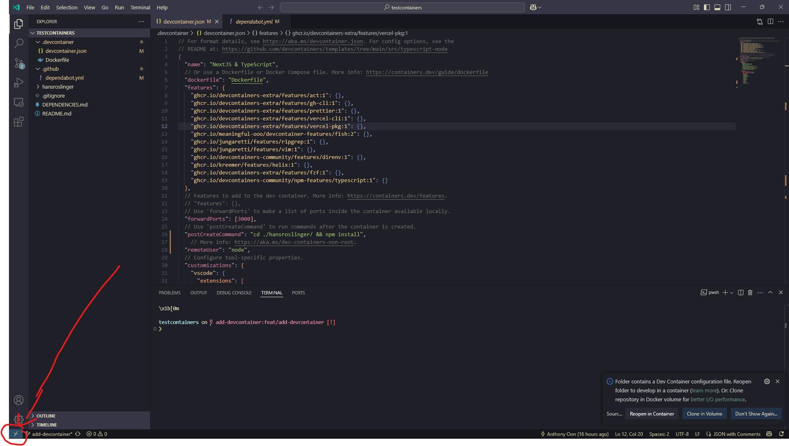
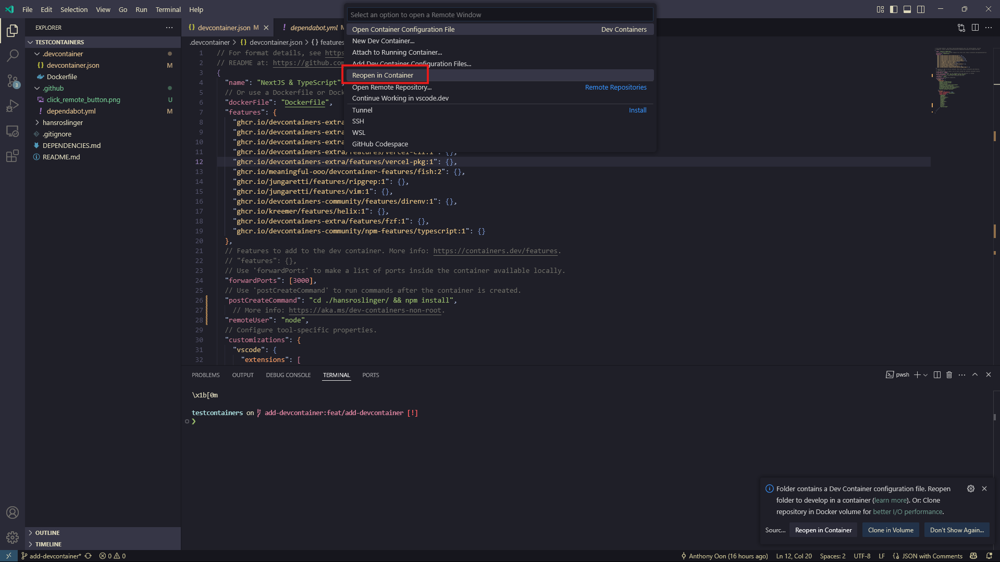
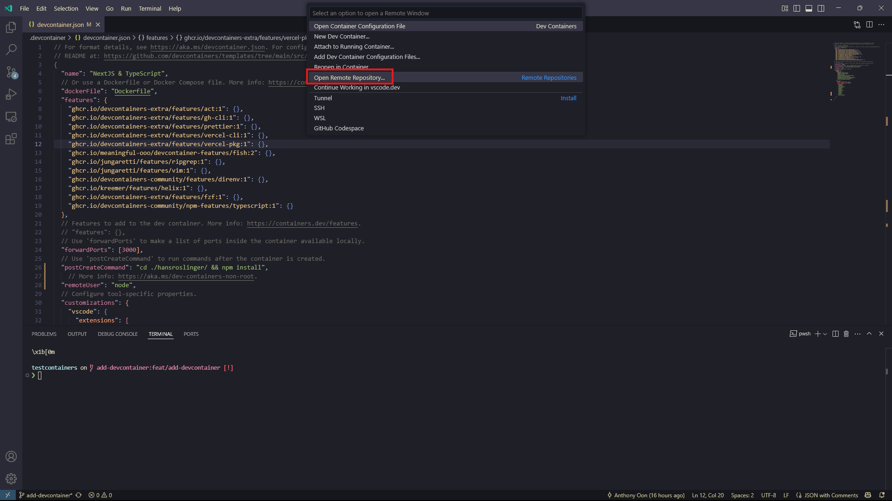

# DevContainer

We use VSCode DevContainers[^1] to configure VSCode Extensions and system-wide tooling (node, npm). We can add extra

For project-specific tooling we maintain a `package.json` of dependencies using `npm`. Add an npm dependency with `npm install next@latest`.

This configuration is based on documentation at [Create a Dev Container](https://code.visualstudio.com/docs/devcontainers/create-dev-container#_create-a-devcontainerjson-file)

To setup the repository for local development with VSCode:

- Follow the installation setup for DevContainers up to "Check the Container" at [Dev Containers Tutorial](https://code.visualstudio.com/docs/devcontainers/tutorial)

- Click the VSCode Remote button
  
  If you want access to the project outside of the container, clone the git repository locally and open the folder in VSCode. Then:
- Select the "Reopen in Container" option
  

If you only want the project in the container, it can be stored within a Docker volume for faster IO. Then:

- Select the "Open Remote Repository" option and authenticate with Github
  

The initial build of the container may take a while, but future builds will be cached and if the container is not modified it should be quick to open.

[^1]: Development Containers https://containers.dev/
