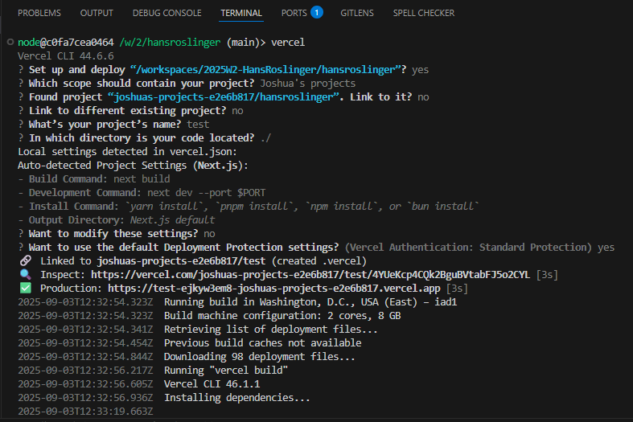

# 2025W2-HansRoslinger 🚀

_Last Updated: 24 October 2025_

Welcome to the **HansRoslinger** repository! This project is dedicated to designing and implementing a gesture-based presentation tool called **Yubi**, which integrates the presenter into the experience. **Yubi** uses natural hand movements to control slides and highlight content, making online presentations more expressive, engaging, and human-centered.

**Yubi** is currently hosted at: https://hans-roslinger.vercel.app/

## Table of Content

- [Overview of repository](#overview-of-repository)
  - [Repository Layout](#repository-layout)
- [Project Requirements](#project-requirements)
  - [Hardware](#hardware)
  - [Software](#software)
- [Suggested Tutorials](#suggested-tutorials)
- [Project Setup](#project-setup)
  - [Clone Git Repository](#clone-git-repository)
  - [Docker Desktop (If using Dev Container)](#docker-desktop-if-using-dev-container)
  - [Dev Container (VS Code)](#dev-container-vs-code)
  - [Vercel](#vercel)
  - [Prisma](#prisma)
  - [AWS S3](#aws-s3)
- [Running the App](#running-the-app)
  - [Running with a Dev Container (Recommended)](#running-with-a-dev-container-recommended)
  - [Running Outside a Dev Container](#running-outside-a-dev-container)
- [Deployment](#deployment)
- [Branching and Versioning](#branching-and-versioning)
- [Common Issues](#common-issues)
- [Project Team](#project-team)
  - [Systems Architects](#️-systems-architects)
  - [Project Managers](#️-project-managers)
  - [Release Train Engineers](#-release-train-engineers)

## Overview of repository

This repository follows a mono-repo structure that includes both frontend and backend components for the **HansRoslinger (Yubi)** application.  
It uses **Next.js** and **TypeScript** for the frontend, with **Prisma** for database management and **Vercel** for deployment.  
The setup supports development inside a **Dev Container** for consistent environment management.

### Repository Layout

```
2025W2-HansRoslinger/
├── .devcontainer/ # VS Code Dev Container configuration (Next.js + TypeScript)
├── .github/ # GitHub configuration (CI/CD workflows)
├── .vscode/ # VS Code settings and workspace configurations
├── documentation/ # Project documentation and setup guides
├── hansroslinger/ # Main application code
│ ├── cache/ # Cached assets
│ ├── prisma/ # Prisma schema and migration files
│ ├── public/ # Static assets (images, icons, etc.)
│ ├── src/ # Source code (components, pages, hooks, utils)
│ ├── next.config.ts # Next.js configuration
│ ├── package.json # Application dependencies
│ └── tsconfig.json # TypeScript configuration
├── technology_tutorial/ # Technology spikes, experimental work by team members to explore and learn the tech stack
├── DEPENDENCIES.md # Documentation of external dependencies
├── package.json # Root-level dependencies
└── README.md # Project overview and setup instructions
```

## Project Requirements

### Hardware

The project is a client-side heavy application, so most hardware requirements apply to the client side. The requirements include:

- A working webcam
- A modern CPU
- At least 8 GB of RAM
- A GPU (not required, but recommended for improved performance)

### Software

- Node.js version 18 or later
- Git for version control
- Docker Desktop (not required, but recommended)
- Visual Studio Code with the Dev Containers extension (not required, but recommended)
- Google Chrome for testing and debugging (any browser can be used, but Chrome is recommended)
- Vercel for deployment
- Prisma for database management
- AWS S3 for storing user files

## Suggested Tutorials and Documentation

To help contributors and new developers become familiar with the technologies used in this project, we’ve compiled the following official documentation and tutorial resources.

### Documentation

#### Core Frameworks and Tools

- [Next.js Documentation:](https://nextjs.org/docs)Official guide to the Next.js framework.
- [TypeScript Handbook:](https://www.typescriptlang.org/docs/handbook/intro.html) Learn the fundamentals of TypeScript.
- [Prisma Docs:](https://www.prisma.io/docs) ORM setup, schema design, and database interaction guide.
- [Vercel Deployment Guide:](https://vercel.com/docs) Steps for deploying and managing projects on Vercel.
- [Docker Getting Started:](https://docs.docker.com/get-started/) Basics of Docker and containerized development.
- [Dev Containers in VS Code:](https://code.visualstudio.com/docs/devcontainers/containers) Guide to setting up and using Dev Containers in VS Code.

#### Gesture Recognition and MediaPipe

- [MediaPipe Gesture Recognizer (Web):](https://ai.google.dev/edge/mediapipe/solutions/vision/gesture_recognizer/web_js) Documentation for gesture recognition using MediaPipe in web apps.
- [MediaPipe Image Segmenter (Web):](https://ai.google.dev/edge/mediapipe/solutions/vision/image_segmenter/web_js) Guide for background removal and image segmentation in MediaPipe.

#### AWS and Monitoring

- [AWS S3 Documentation:](https://docs.aws.amazon.com/s3/) Overview of AWS S3 configuration and permissions.
- [AWS S3 Access Policy Language Overview:](https://docs.aws.amazon.com/AmazonS3/latest/userguide/access-policy-language-overview.html) Reference for creating custom access policies.
- [AWS CloudWatch Monitoring Guide:](https://docs.aws.amazon.com/AmazonCloudWatch/latest/monitoring/monitor_estimated_charges_with_cloudwatch.html) Monitoring estimated usage and performance metrics.

### Tutorials

#### Core Frameworks

- [Next.js Crash Course – All 12 Concepts You Need to Know](https://youtu.be/vwSlYG7hFk0?si=SOpIn0iBfEeTLw9W)
- [Learn React with One Project](https://youtu.be/Rh3tobg7hEo?si=YfYh-Q1Qu2jEv6h6)

#### Gesture Recognition and MediaPipe

- [Gesture Control Tutorial (Part 1)](https://youtu.be/RebA5J-rlwg?si=m5C22pF2drSUF2lL)
- [Gesture Control Tutorial (Part 2)](https://youtu.be/mDRoyPFJvlU?si=OWLgdZ9ziYbUPssf)
- [Gesture Recognition with MediaPipe Hands](https://youtu.be/gpquYmcpZpo?si=AyROys-psdDxXWnL)
- [Advanced Gesture Interactions](https://youtu.be/_KhrGFV_Npw?si=UxmEyHq6fh7dP4e2)

## Project Setup

Using Visual Studio Code (VS Code) with the Dev Containers extension is recommended for this project. If you choose not to use it, you may skip the steps for [Docker Desktop](#docker-desktop-if-using-dev-container) and [Dev Container](#dev-container-vs-code) setups.

### Clone Git Repository

- Open a terminal in your desired directory.
- Clone the repository.

  ```bash
  git clone https://github.com/Monash-FIT3170/2025W2-HansRoslinger.git
  ```

### Docker Desktop (if using Dev Container)

- Download and install Docker Desktop based on your OS [here](https://docs.docker.com/desktop/).
- Please refer to the official installation guide to install docker desktop
- Start docker desktop.
- Verify the installation.

  ```bash
  docker --version
  ```

### Dev Container (VS Code)

- Install VS Code if you haven’t already. Install based on your operating system and follow the instructions on the official website
  - [Windows](https://code.visualstudio.com/docs/setup/windows)
  - [macOS](https://code.visualstudio.com/docs/setup/mac)
  - [Linux](https://code.visualstudio.com/docs/setup/linux)
- Open VS Code
- Got to Extensions (`Ctrl+Shift+X` / `Cmd+Shift+X`)
- Search for `Dev Container` and install

### Vercel

Vercel is used to deploy the project as a web application. If you wish to deploy the project, please set up vercel:

- Create an account or login to Vercel [here](https://vercel.com/signup)
- Install Vercel CLI if not already installed

  ```bash
  npm install -g vercel
  ```

- Authenticate with Vercel

  ```bash
  vercel login
  ```

- Set Vercel Token

  - Get your token [here](https://vercel.com/account/settings/tokens?utm_source=chatgpt.com)
  - Add it to your .env file

  ```bash
  VERCEL_TOKEN=your_token_here
  ```

- To deploy the project, follow the steps in the [Deployment](https://vercel.com/account/settings/tokens?utm_source=chatgpt.com) section.

### Prisma

If you plan to replicate this project, you may need to set up a database. The exact steps will depend on your hosting platform. For those using Vercel (as in our setup), follow these instructions:

- Open your project in Vercel and navigate to the Storage section.
- Select Prisma Postgres and click Continue.
- Choose the recommended region and proceed.
- Enter a name for your database.
- Wait for the provisioning process to complete.
- Once finished, connect to your new database. Once connected, your Prisma Postgres database will be ready for use.
- Link your project to Vercel. This associates your local project with the corresponding project in your Vercel team.

  ```bash
  vercel link
  ```

- Pull environment variables from Vercel. This will download the environment variables (including your Prisma Postgres connection string) and save them into a local `.env` file.

  ```bash
  vercel env pull .env
  ```

- Run your initial Prisma migration.This creates the database schema in your Prisma Postgres instance and gets your database ready for use.

  ```bash
  npx prisma migrate dev --name init
  ```

### AWS S3

**S3 is used to store the uploaded files.**

- Search `s3` in the aws search box and navigate to the s3 dashboard.
- Click on the region on the top right and select `sydney`.
- Click on `create "Bucket"`.
- On the general configuration page enter the details for the bucket such as name and region (sydney).
- Scroll down and click `create bucket`.

**Create s3 access policy**

- Search `IAM` in the aws search box and navigate to the IAM dashboard
- Click on `Policies` then click `create policy`
- On the policy creation page click on `json` and paste the following access policy:

```json
{
  "Version": "2012-10-17",
  "Statement": [
    {
      "Sid": "dth",
      "Effect": "Allow",
      "Action": [
        "s3:GetObject",
        "s3:ListBucket",
        "s3:PutObject",
        "s3:ListBucket",
        "s3:PutObjectAcl",
        "s3:AbortMultipartUpload",
        "s3:ListBucketMultipartUploads",
        "s3:ListMultipartUploadParts",
        "s3:DeleteObject"
      ],
      "Resource": [
        "arn:aws:s3:::yubi-assets/",
        "arn:aws:s3:::yubi-assets",
        "arn:aws:s3:::yubi-assets//",
        "arn:aws:s3:::yubi-assets///"
      ]
    }
  ]
}
```

- Click next then click save changes

**Create s3 user + access key**

- On the `IAM` dashboard click on user
- Click `create user`
- On the user creation page enter username that you want and click next
- Select attach policy and then select the policy you made before
- Then click create user
- Navigate to the user you just created and click "create access key"
- Then select `3rd party service` and click next
- Finally click create key and save your access key credentials

**Adding s3 cred to vercel**

Add the following variables as a env variable in vercel:

- Aws region
- Bucket name
- Access key
- Secret key

## Running the App

The project can either be run inside a Dev Container (using the VS Code extension) or directly on your machine **without** using Docker.

### Running with a Dev Container (Recommended)

- Open the project folder in VS Code.
- Reopen folder in a Dev Container:
  - Press `F1` to access the command palette
  - Select `Dev Container: Reopen in Container`
- Once built, open a terminal inside the Dev Container.
- Navigate to the project directory.

  ```bash
  cd hansroslinger
  ```

- Install the dependencies and start the app:

  ```bash
  npm install
  npm run dev
  ```

- Access the app in your browser at: http://localhost:3000

### Running Outside a Dev Container

Docker is not required to run the project outside of Dev Container.

#### Prerequisites

To run outside of dev container, install Node.js LTS (recommended) [here](https://nodejs.org/en/download).

Once installed, verify the installation.

```bash
node --version
npm --version
```

#### Running the app

- From the root directory, navigate inside the project directory and install packages.

  ```bash
  cd hansroslinger
  npm install
  ```

- Start the Next.js dev server.

  ```bash
  npm run dev
  ```

- Access the app in your browser at: http://localhost:3000

## Deployment

These steps assume that this is the first time you are using vercel to deploy.

- Make sure vercel cli is installed and token is added to environment variables.
- Open the project in a code editor.
- Navigate to the project directory

  ```bash
  cd hansroslinger
  ```

- Run deployment command in the terminal.

  ```bash
  vercel
  ```

- Select the following option to successfully deploy the project on Vercel:

  ```txt
  Set up and deploy “/workspaces/2025W2-HansRoslinger/hansroslinger” yes
  Which scope should contain your project? [Select your Vercel team or personal account]
  Link to existing project? no
  What’s your project’s name? hansroslinger
  In which directory is your code located? ./
  Want to modify these settings? no
  Want to use the default Deployment Protection settings? yes
  ```

Example:



## 📄 Project Documentation

Additional project-related documentation and resources are available in the [`/documentation`](./documentation) folder.

| Document                                                                              | Description                                                                                |
| ------------------------------------------------------------------------------------- | ------------------------------------------------------------------------------------------ |
| [Branching and Versioning Strategy](./documentation/branching_versioning_strategy.md) | Explains our Git workflow, commit conventions, and release versioning process.             |
| [Feature Roadmap](./documentation/project_roadmap.md)                                 | Outlines completed, ongoing, and planned features, with links to milestones and timelines. |
| [Known Bugs](./documentation/known_bugs.md)                                           | Lists current known issues and their corresponding GitHub references.                      |
| [Privacy and Compliance Document](./documentation/privacy_policy.pdf)                 | Details privacy considerations and data protection measures.                               |
| [Maintenance Guide](./documentation/maintenance_guide.pdf)                            | Provides instructions for maintaining and updating the system post-deployment.             |
| [User Guide](./documentation/user_guide.pdf)                                          | Step-by-step guide for end users to navigate and use the Yubi app.                         |

## Common Issues

### Hot Reload

When running the project inside a Dev Container, you might encounter an issue where the website does not hot reload. This means that after saving a file, the app does not automatically reload to reflect the changes. In this case, you have to manually stop (`Ctrl+C`) and restart the dev server, which is inconvenient.

To resolve this issue, clone the project in a container volume:

- Start docker desktop.
- Open VS Code and ensure Dev Container extension is .
- Press `F1` to access the command palette.
- Type and select `Dev Containers: Clone Repository in Container Volume...`
- Paste the repository url: https://github.com/Monash-FIT3170/2025W2-HansRoslinger.git
- Wait until dev container is built
- Once built, navigate into the project directory:

  ```bash
  cd hansroslinger
  ```

## Project Team

Our team consists of **Systems Architects**, **Project Managers**, and **Release Train Engineers**, working together to build an efficient and robust AI solution.

### 🏛️ Systems Architects

Responsible for designing the **technical architecture**, ensuring scalability, reliability, and optimal performance.

- Vedansh Malhan: vmal0014@student.monash.edu
- Joshua Cui: xcui0015@student.monash.edu
- Dana McDonald: dmcd0006@student.monash.edu

### 🏗️ Project Managers

Oversee the **planning, execution, and coordination** of the project, ensuring milestones and deadlines are met.

- Justin Thiha, jthi0011@student.monash.edu
- Maxwell Lay: mlay0005@student.monash.edu
- Albert Liesman: alie0018@student.monash.edu
- Harrison Fulton: hful0003@student.monash.edu
- Toby Marsden: tmar0048@student.monash.edu

### 🚂 Release Train Engineers

Facilitate **Agile development**, ensuring smooth collaboration across teams and delivering value efficiently.

- Stephanie Sisilia Simangunsong: ssim0033@student.monash.edu
- Zachary Yeap: zyea0002@student.monash.edu
- Rohan Jaggi: rjag0003@student.monash.edu
- Joanne Li Wen Yew: jyew0004@student.monash.edu
- William Eap: weap0001@student.monash.edu
- Nguyen Viet Phuc (Tom): vngu0096@student.monash.edu
