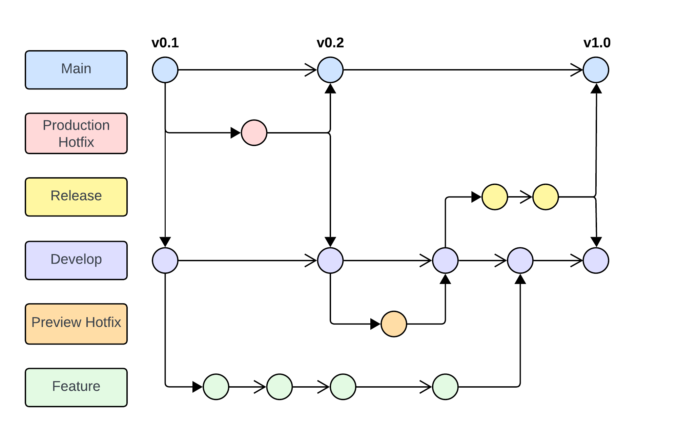

# Branching and Versioning Strategy

_Last Updated: 24 October 2025_

To maintain a structured and efficient development process, the team follows a defined **Git branching model** and **versioning convention**.

## Branching Strategy

The diagram below represents the branching model the team use throughout the project. Each node (circle) indicates a commit made on a specific branch.



A description of each branch type is provided below.

### Main Branches

- **main:** Holds production-ready code.

  - Always contains the latest stable release.
  - Represents the production environment.

- **develop:** Contains the latest integrated features and fixes ready for the next release.
  - All testing and integration occur here before merging into `main`.
  - Deploys to the preview environment.

---

### Feature Branches

All new features must be developed in **feature branches**.

- Branches should be named descriptively, and optionally include a ticket number or task identifier.  
  **Example:**
  ```
  feature/login-page
  feature/1234-user-auth
  ```
- Always create feature branches from the `develop` branch.

---

### Release Branches

Once `develop` reaches a stable point and is ready for release, create a **release branch**.

- **Example:**
  ```
  release/v1.0
  ```
- Used for finalizing features, fixing bugs, and preparing for deployment.

---

### Hotfix Branches

For critical bug fixes, create a **hotfix branch** depending on the target environment:

- **Production hotfix (from main):**

  ```
  hotfix/critical-bug
  ```

  Merge the fix back into both `main` and `develop`.

- **Preview hotfix (from develop):**
  ```
  hotfix/critical-bug
  ```
  Merge the fix back into `develop`.

---

### Chore Branches

For routine updates or maintenance tasks (like dependency upgrades or tool setup), create a **chore branch**.

- **Example:**
  ```
  chore/update-linter
  ```

## Commit Messages

Commit messages should be **clear, concise, and standardized** to maintain readability and traceability.

### Format

```
<type>(<scope>): <message>
```

**Example:**

```
feat(auth): add login API integration
```

### Commit Types

| Type       | Description                                   |
| ---------- | --------------------------------------------- |
| `feat`     | A new feature                                 |
| `hotfix`   | A bug fix                                     |
| `docs`     | Documentation changes                         |
| `style`    | Code style or formatting changes              |
| `refactor` | Code refactoring (non-functional)             |
| `test`     | Adding or modifying tests                     |
| `chore`    | Routine updates (dependencies, tooling, etc.) |

### Guidelines

- Keep commits small and focused on one change.
- Avoid committing build outputs or IDE files (use `.gitignore`).
- Write meaningful messages — avoid vague ones like _“fix stuff”_ or _“update”_.

## Pull Requests (PRs)

### Workflow

- Create a PR for any branch to be merged into `develop` or `main`.
- Each PR must be reviewed by at least **one other team member** before merging.
- Ensure **all tests pass** before submitting a PR.
- For UI/UX features:
  - Include a **screenshot or recording** of the working feature.
  - Add a **summary** describing functionality.
  - Link the PR to its related ticket or task.

### PR Naming

Use the same convention as commits:

```
feat(auth): implement Auth for login
```

### PR Approval

- At least one team member must approve before merging.
- Address all feedback before merging.
- Reviewers should test the feature locally and upload a screenshot in the approval description.

### PR Guidelines

- Rebase your branch with the latest version of the target branch (`develop` or `main`) before creating a PR.
- Provide context in your PR description (e.g., linked issues or tickets).
- Follow the PR template provided in the repository:
  - **Required:** Branch rebased, tests verified, linting passed.
  - **Optional:** Added new tests.
  - **For UI/UX:** Screenshot or recording of developed feature.
- Ensure all required sections in the PR template are completed.

## Merge Strategy

- Always **rebase and merge** to maintain a clean commit history.
- Avoid merge commits unless absolutely necessary.

### Conflict Resolution

If conflicts occur:

1. Resolve them locally.
2. Re-run tests and verify successful builds.
3. Push the resolved code after confirming stability.

### Merge Approval

- Only merge PRs that have passed all CI/CD checks (tests, linting, etc.).
- Ensure the PR has been reviewed and approved by at least one other team member.

## Versioning

The following outline how the team manage version in out project to ensure consistency across the team for major releases, minor fixes and patching bugs. We follow **Semantic Versioning** strategy to indicate changes in teh project. The format follows: `v[MAJOR].[MINOR].[PATCH]`, example: `v3.1.1`.

- **MAJOR:** Incremented when features are added to the application. WHich may includes introducing significant changes like a major design or architecture changes or adding a new feature that may require end user to learn or relearn how to use the new feature.
- **MINOR:** Incremented when less significant new features were added. These should not break existing functionality but add enhancement to the existing ones.
- **PATCH:** Incremented when bug fixes are made. This changes does not affect functionality but fixes the existing issues in the code.
